<div align="center">

# 🎀 MammoSights

### Explainable breast-cancer classification from mammogram images — from ML experimentation to a deployed full-stack application

[](https://mammosights.vercel.app)
[](https://mammosights-api.vercel.app/health)
[](https://github.com/Payoshnee/Breast-Cancer-Detection-Mammogram-Images-)
[](https://github.com/Payoshnee/MammoSights)

</div>

---

## Overview

**MammoSights** brings together two parts of the project:

1. **Machine-learning experimentation** — mammogram preprocessing, image-quality analysis, decomposition experiments, deep feature extraction, feature ranking, explainability, dimensionality reduction, and classification.
2. **Production application** — a secure Next.js + FastAPI application that exposes the trained model through an authenticated web experience with prediction probabilities, Grad-CAM explanations, and nearby-care discovery.

> [!IMPORTANT]
> **MammoSights is not a medical device and is not intended for diagnosis.**
> The results shown here are experimental, dataset-specific model results. They must not be interpreted as clinical performance or used to make medical decisions.

---

# Part I — Machine Learning

## 1. Original ML / Colab work

The original model-development work is maintained separately:

### 📓 [Breast Cancer Detection — Mammogram Images](https://github.com/Payoshnee/Breast-Cancer-Detection-Mammogram-Images-)

That repository contains the notebook-oriented experimentation behind the project. MammoSights is the deployable application built around the finalized inference pipeline.

---

## 2. Research workflow

The broader ML experimentation explored a multi-stage mammography workflow:

<p align="center">
  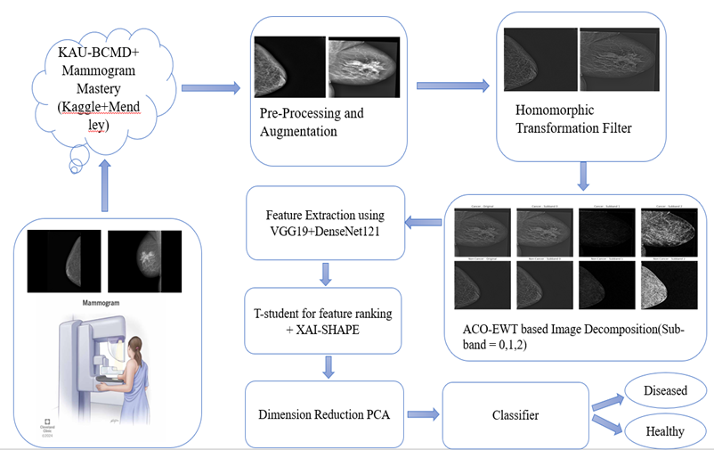
</p>

The research diagram captures the full experimental direction:

```text
Dataset construction
→ preprocessing + augmentation
→ homomorphic transformation
→ ACO–EWT image decomposition
→ VGG19 + DenseNet121 feature extraction
→ statistical / explainability-driven feature analysis
→ dimensionality reduction
→ classification
→ Cancer / Non-Cancer
```

### Important distinction

The figure above represents the **broader experimental notebook workflow**. Some stages, especially **ACO–EWT decomposition and the SHAP / feature-ranking experiments**, were used for investigation and interpretation.

The **currently deployed MammoSights model** uses the streamlined production pipeline described later in this README:

```text
crop → resize → CLAHE → homomorphic filtering
→ VGG19 + DenseNet121
→ StandardScaler → PCA(100) → SelectKBest(30)
→ StandardScaler → RBF-SVM
```

Keeping these two views separate prevents experimental branches from being confused with the exact production inference path.

---

## 3. Dataset composition

<p align="center">
  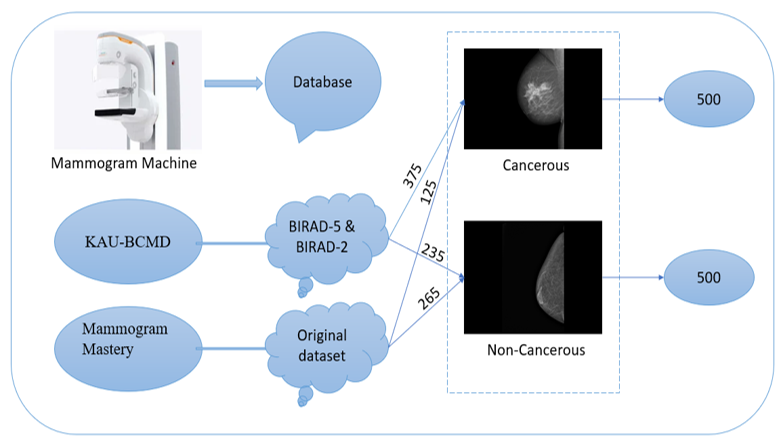
</p>

The dataset design combines mammograms from **KAU-BCMD** and **Mammogram Mastery** and organizes them into two target classes.

As shown in the dataset diagram:

| Source | Cancerous | Non-Cancerous |
|---|---:|---:|
| KAU-BCMD / BI-RADS selection | 375 | 235 |
| Mammogram Mastery | 125 | 265 |
| **Combined** | **500** | **500** |

This gives a balanced working dataset of:

```text
500 Cancerous
500 Non-Cancerous
-----------------
1000 images
```

A balanced class distribution is useful because raw accuracy is less dominated by one class. It does **not**, by itself, guarantee that the data are clinically representative.

---

## 4. Preprocessing and enhancement

The mammogram pipeline uses image preprocessing to reduce irrelevant background and improve useful contrast before feature extraction.

### 4.1 Automatic crop
Black borders are removed so that the model spends less representational capacity on empty background.

### 4.2 Resize
Each mammogram is normalized to:

```text
512 × 512
```

### 4.3 CLAHE
**Contrast Limited Adaptive Histogram Equalization** improves local contrast while limiting excessive amplification.

Current settings:

```text
clipLimit = 2.0
tileGridSize = 8 × 8
```

### 4.4 Homomorphic filtering
Homomorphic filtering separates illumination and reflectance behavior in the frequency domain. In this project it is used to suppress low-frequency illumination variation while emphasizing higher-frequency structural information.

Current implementation:

```text
d0 = 30
rh = 2.0
rl = 0.5
c  = 1.0
```

---

## 5. Image-quality analysis

The notebook also evaluates the effect of preprocessing using image-quality measures.

<p align="center">
  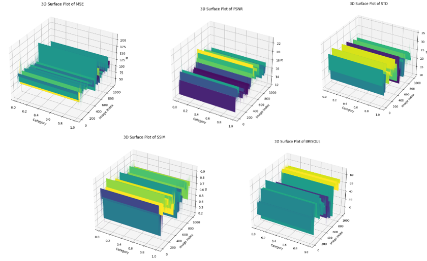
</p>

The 3D visualizations compare quality-related measurements across image samples / categories.

<p align="center">
  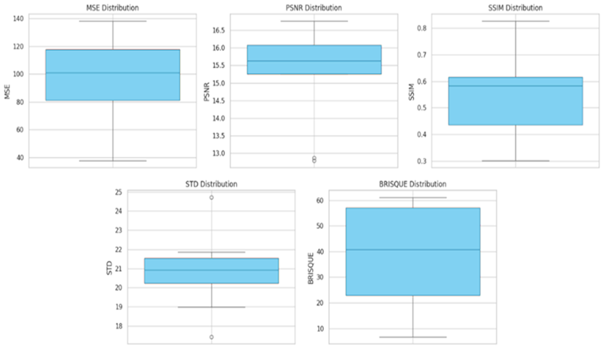
</p>

The boxplots summarize median, spread, and outliers.

### Metrics used

| Metric | What it describes | Typical interpretation |
|---|---|---|
| **MSE** | Pixel-level reconstruction error | Lower means less numerical difference |
| **PSNR** | Signal-to-noise quality relative to reconstruction error | Higher generally indicates closer reconstruction |
| **SSIM** | Structural similarity | Higher means stronger structural similarity |
| **STD** | Intensity variation | Useful as a simple contrast / dispersion indicator |
| **BRISQUE** | No-reference perceptual image-quality score | Lower is generally considered better |

These measures evaluate **image transformation quality**, not cancer-classification accuracy. They help check whether preprocessing changes images in a controlled way without directly claiming that a higher PSNR or SSIM necessarily improves diagnosis.

---

## 6. ACO–EWT decomposition experiment

One experimental branch used an **Ant Colony Optimization (ACO) based Empirical Wavelet Transform (EWT)**.

<p align="center">
  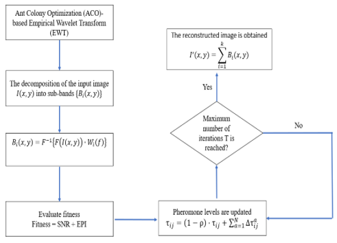
</p>

Conceptually, the process:

1. decomposes the mammogram into frequency sub-bands,
2. evaluates a fitness objective,
3. updates ACO pheromone values,
4. iterates until the stopping criterion,
5. reconstructs / selects the relevant decomposition.

The notebook flowchart expresses the decomposition as sub-band components \(B_i(x,y)\), with fitness based on image-quality criteria such as **SNR** and **EPI**.

### Example decomposition

<p align="center">
  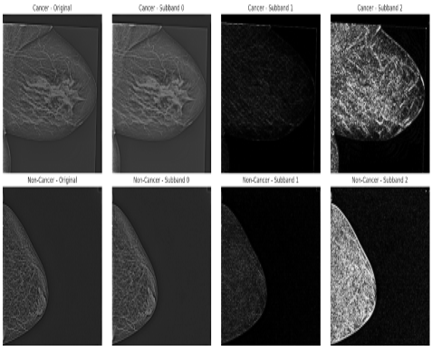
</p>

The figure shows original Cancer / Non-Cancer mammograms alongside multiple extracted sub-bands.

Different sub-bands emphasize different frequency structures. This experiment was useful for studying whether frequency-domain decomposition could expose complementary texture information.

> **Production note:** ACO–EWT is shown here as part of the experimental ML investigation. It is not part of the current deployed MammoSights inference path.

---

## 7. Deep feature extraction

The finalized feature representation combines two pretrained CNN backbones.

### VGG19

```text
512 pooled features
```

### DenseNet121

```text
1024 pooled features
```

### Feature fusion

```text
VGG19      512
DenseNet  1024
--------------
Combined  1536 dimensions
```

Using both networks allows the classical classifier to operate on a richer representation than either backbone provides alone.

---

## 8. Feature analysis and ranking

Several analyses were used to understand which transformed features were influential.

### 8.1 Permutation importance

<p align="center">
  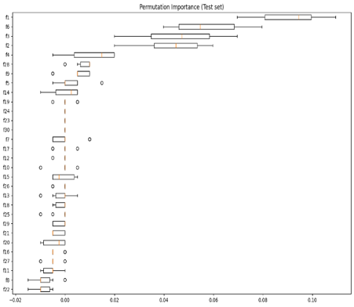
</p>

Permutation importance measures how much predictive performance changes when a feature is randomly shuffled.

A larger positive importance means the model relies more strongly on that feature for the evaluated set.

The plot suggests that a relatively small subset of transformed features contributes substantially more than the rest.

### 8.2 Mean-decrease-impurity feature ranking

<p align="center">
  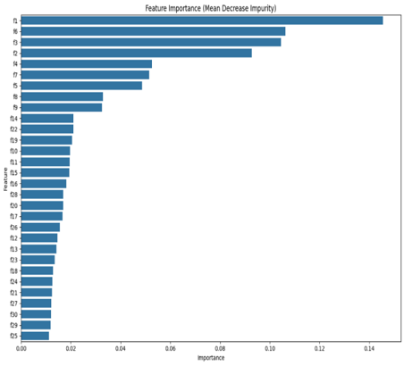
</p>

The mean-decrease-impurity analysis provides a second ranking view. The strongest bars are concentrated among a few features, reinforcing the idea that the learned representation is not equally informative across all dimensions.

Because these are learned / transformed features, labels such as `f1`, `f6`, etc. are **not direct clinical concepts** such as mass shape or breast density.

---

## 9. SHAP-based explainability experiments

The notebook also explores SHAP to understand direction and magnitude of feature influence.

<p align="center">
  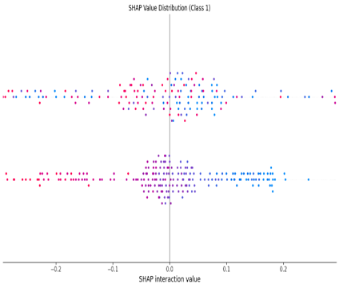
</p>

<p align="center">
  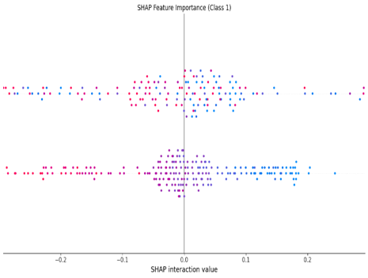
</p>

These plots show how feature contributions distribute around zero for the analyzed class.

- positive SHAP values push the model output in one direction,
- negative values push it in the opposite direction,
- larger absolute values indicate stronger influence.

### SHAP summary

<p align="center">
  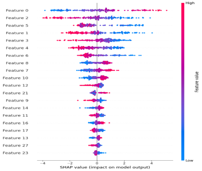
</p>

In the summary plot, the widest SHAP spreads belong to the top transformed features, indicating that those dimensions have the largest effect on model output over the analyzed samples.

The color encodes whether the feature value itself is relatively high or low.

> These are **latent / transformed model features**. SHAP explains the model's numerical feature space; it does not convert those features into radiological findings.

---

## 10. Deployed MammoSights inference pipeline

The deployed application uses the following exact streamlined pipeline:

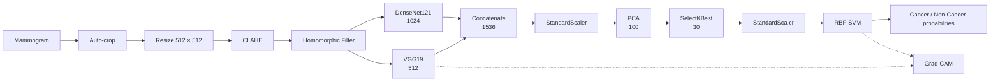

The deployed class convention is:

```text
0 = Non-Cancer
1 = Cancer
```

---

## 11. Evaluation protocol

The exported evaluation artifact reports:

```text
Training split: 801 images
Held-out test: 201 images
Positive class: Cancer
```

The train/test split occurs before fitting the scaler, PCA, feature selection, and classifier for the held-out evaluation.

A **5-fold stratified cross-validation** is also run on the training split.

After evaluation, the final deployment pipeline is fitted using all available feature samples.

---

## 12. Model results

### Held-out test set

| Metric | Result |
|---|---:|
| **Accuracy** | **97.51%** |
| **Cancer sensitivity / recall** | **97.00%** |
| **Specificity** | **98.02%** |
| **ROC AUC** | **0.9963** |
| Cancer precision* | 97.98% |
| Cancer F1* | 97.49% |
| Negative predictive value* | 97.06% |

\*Derived from the exported confusion matrix.

### Confusion matrix

| | Predicted Non-Cancer | Predicted Cancer |
|---|---:|---:|
| **Actual Non-Cancer** | **TN = 99** | **FP = 2** |
| **Actual Cancer** | **FN = 3** | **TP = 97** |

```text
Correct:        196 / 201
False positive:   2
False negative:   3
```

### 5-fold CV on the training split

| Metric | Mean ± SD |
|---|---:|
| **Accuracy** | **96.01% ± 1.45%** |
| **Cancer sensitivity** | **94.27% ± 2.02%** |
| **ROC AUC** | **0.9869 ± 0.0106** |

---

## 13. What the results suggest

### Strong separation on this split
The held-out ROC AUC of **0.9963** indicates strong discrimination between the two classes on this particular evaluation split.

### Balanced error profile
The test confusion matrix contains:

```text
3 false negatives
2 false positives
```

so both sensitivity and specificity remain high on the current split.

### Cross-validation is slightly more conservative
The 5-fold CV accuracy (**96.01%**) is lower than the single held-out accuracy (**97.51%**). That difference is expected and is a useful reminder not to over-interpret a single split.

### Accuracy is not the whole story
For a breast-cancer classifier, sensitivity is especially important because false negatives correspond to missed positive cases. This is why the README reports sensitivity, specificity, AUC, and the confusion matrix rather than accuracy alone.

### Important validation caveat
If multiple images / views / augmentations come from the same patient, an image-level random split can overestimate generalization.

A stronger future evaluation should use:

```text
patient-level split
→ independent external dataset
→ calibration analysis
→ detailed FP / FN review
```

The reported values should therefore be described as **experimental performance on the current dataset split**, not clinical accuracy.

---

## 14. Grad-CAM in the deployed system

MammoSights adds a visual explanation to the deployed prediction.

For the VGG19 branch, the application propagates influence from the **actual deployed RBF-SVM decision function** back toward VGG19's `block5_conv4` feature maps.

That is important: the heatmap is tied to the final classifier decision rather than being produced from an unrelated ImageNet classification head.

The heatmap should be interpreted as:

> **regions that had greater influence on the model's prediction**

and **not** as a lesion / tumor segmentation map.

---

# Part II — MammoSights Web Application

## 15. Live application

### 🌐 [mammosights.vercel.app](https://mammosights.vercel.app)

### ⚡ [API health](https://mammosights-api.vercel.app/health)

### 📓 [Original ML / Colab repository](https://github.com/Payoshnee/Breast-Cancer-Detection-Mammogram-Images-)

---

## 16. Home

<p align="center">
  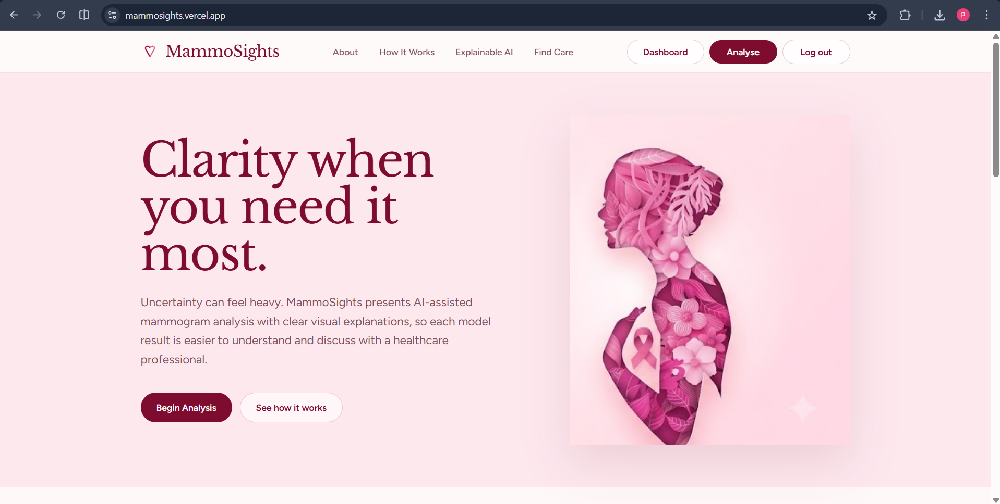
</p>

The landing page introduces the product with a calm visual identity and provides direct paths to analysis, explainability information, and nearby care.

---

## 17. Mammogram upload

<p align="center">
  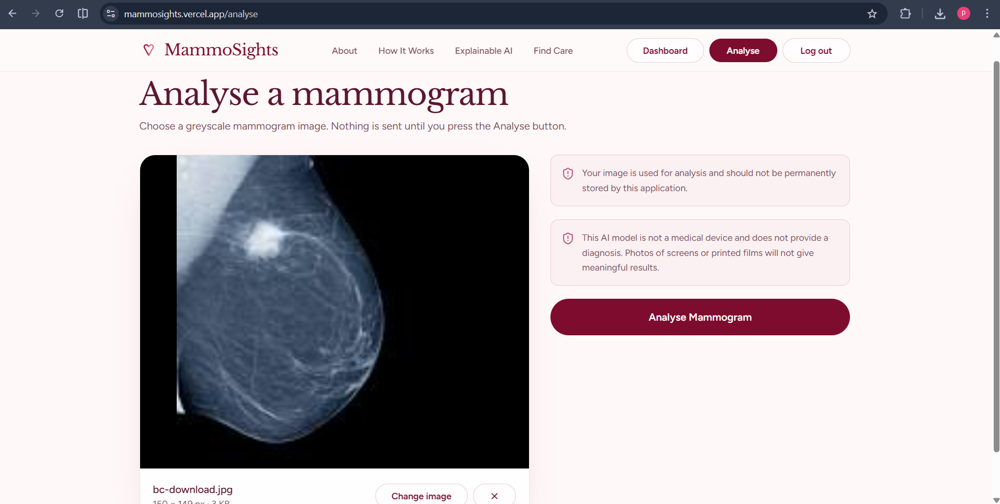
</p>

The analysis screen:

- previews the selected image,
- reminds the user that the tool is not a medical device,
- explains that the image is used for the current analysis,
- sends the image only after the user starts analysis.

Backend validation includes supported image format, upload size, and minimum dimensions.

---

## 18. Analysis state

<p align="center">
  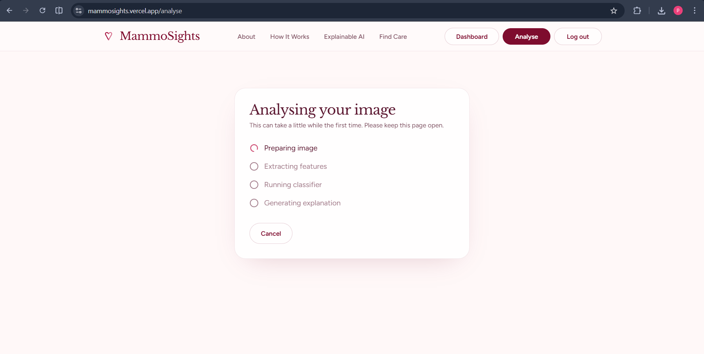
</p>

The UI communicates the conceptual stages:

```text
Preparing image
→ Extracting features
→ Running classifier
→ Generating explanation
```

The production API performs preprocessing, CNN feature extraction, SVM probability estimation, and Grad-CAM generation within one authenticated inference request.

---

## 19. Patient View

<p align="center">
  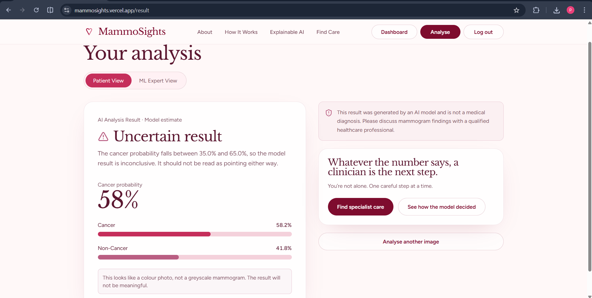
</p>

Patient View focuses on understandable communication:

- Cancer and Non-Cancer probabilities
- an explicit **Uncertain result** state when cancer probability lies between 35% and 65%
- warning messages for unsuitable input
- a clear reminder to discuss mammogram findings with a qualified professional
- links to explanation and care discovery

The probability is presented as a **model estimate**, not a diagnosis.

---

## 20. ML Expert View

<p align="center">
  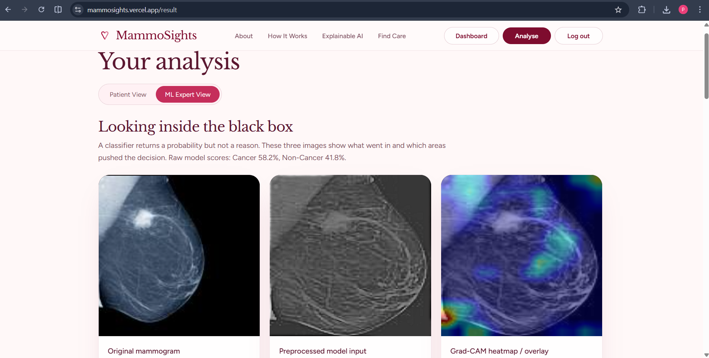
</p>

ML Expert View exposes more of the inference process:

1. original mammogram
2. preprocessed model input
3. Grad-CAM overlay
4. raw class probabilities
5. model architecture / metric information

This supports the project's explainability goal without claiming that the heatmap is medically localized evidence.

---

## 21. Find Care

<p align="center">
  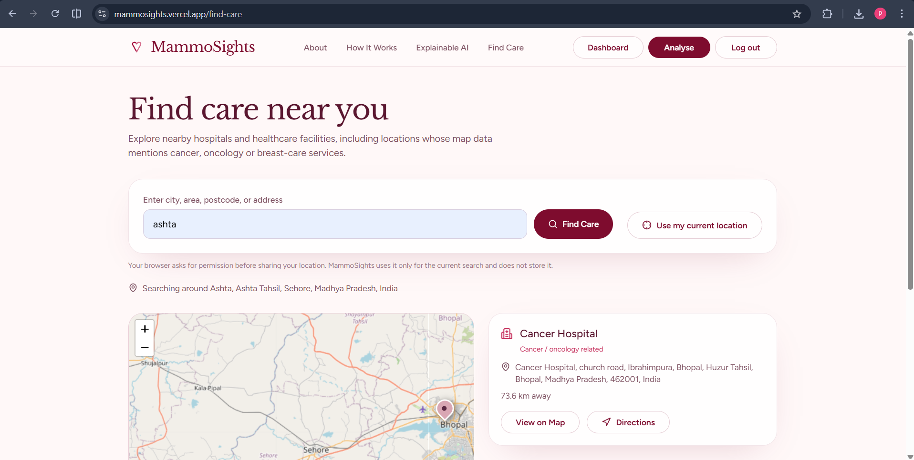
</p>

Users can:

- enter a city, area, postcode, or address,
- use browser location,
- view nearby care options,
- see approximate distance,
- open the result on the map,
- request directions.

<p align="center">
  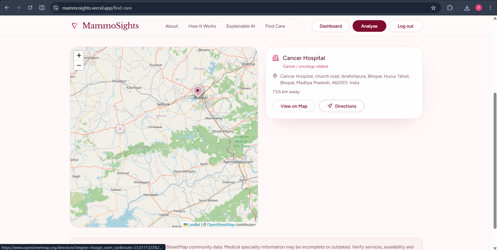
</p>

The feature uses **Leaflet + OpenStreetMap + Nominatim** rather than Google Maps.

Listings depend on community map data and can be incomplete or outdated, so MammoSights presents them as **nearby care options**, not recommendations or endorsements.

---

## 22. Full system architecture

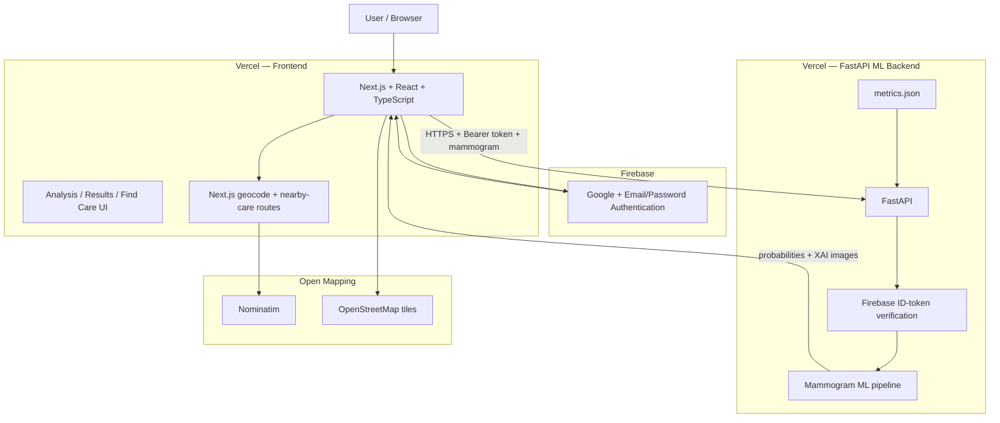

---

## 23. Prediction request flow

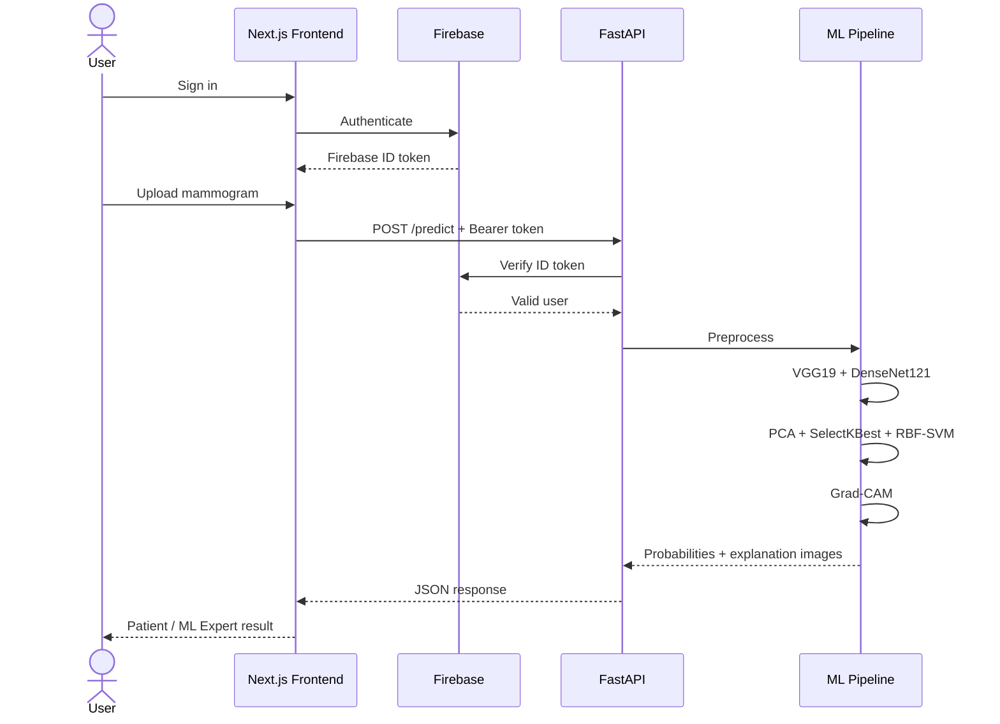

---

## 24. Technology stack

| Layer | Technology |
|---|---|
| Frontend | Next.js, React, TypeScript |
| Styling | Tailwind CSS |
| Authentication | Firebase Authentication |
| Backend | FastAPI, Python |
| Deep learning | TensorFlow / Keras |
| CNN backbones | VGG19, DenseNet121 |
| Classical ML | scikit-learn |
| Classifier | RBF-SVM |
| Image processing | OpenCV, Pillow |
| Explainability | Grad-CAM + notebook SHAP analyses |
| Map UI | Leaflet, React Leaflet |
| Geocoding | Nominatim |
| Map tiles | OpenStreetMap |
| Hosting | Vercel |
| Model serialization | Joblib |

---

## 25. API

Base URL:

```text
https://mammosights-api.vercel.app
```

| Method | Endpoint | Purpose | Authentication |
|---|---|---|---|
| `GET` | `/health` | API / model health | No |
| `GET` | `/metrics` | Exported evaluation metrics | No |
| `POST` | `/predict` | Mammogram inference + XAI | Firebase Bearer token |

Health:

```bash
curl https://mammosights-api.vercel.app/health
```

Expected:

```json
{
  "status": "ok",
  "model_loaded": true,
  "metrics_loaded": true
}
```

---

## 26. Metrics: one source of truth

The canonical deployment metric artifact is:

```text
backend/model/metrics.json
```

The backend exposes it through:

```text
GET /metrics
```

The website's ML metrics view should use that API data so the UI and deployed model remain aligned.

The README mirrors the same current values:

```text
Accuracy:     97.51%
Sensitivity:  97.00%
Specificity:  98.02%
ROC AUC:      0.9963

TN = 99
FP = 2
FN = 3
TP = 97
```

After retraining, update the exported model + `metrics.json`, redeploy the API, and then update the README table.

---

## 27. Repository structure

```text
MammoSights/
│
├── frontend/
│   ├── app/
│   │   ├── analyse/
│   │   ├── api/
│   │   │   ├── geocode/
│   │   │   └── nearby-care/
│   │   ├── dashboard/
│   │   ├── find-care/
│   │   ├── login/
│   │   ├── result/
│   │   ├── layout.tsx
│   │   └── page.tsx
│   ├── components/
│   ├── lib/
│   ├── public/
│   └── package.json
│
├── backend/
│   ├── model/
│   │   ├── pipeline.joblib
│   │   └── metrics.json
│   ├── main.py
│   ├── mammo_core.py
│   ├── train_export.py
│   └── requirements.txt
│
├── docs/
│   └── assets/
│       ├── ml/
│       └── website/
│
├── .gitignore
└── README.md
```

---

## 28. Local development

### Frontend

```bash
git clone https://github.com/Payoshnee/MammoSights.git
cd MammoSights/frontend
npm install
npm run dev
```

Frontend:

```text
http://localhost:3000
```

### Backend

```bash
cd backend
python -m venv .venv
```

Windows PowerShell:

```powershell
.\.venv\Scripts\Activate.ps1
```

Install and start:

```bash
pip install -r requirements.txt
python -m uvicorn main:app --reload
```

Backend:

```text
http://127.0.0.1:8000
```

---

## 29. Security & privacy

- Firebase authentication protects user access.
- `/predict` verifies a Firebase ID token when authentication is required.
- CORS limits allowed frontend origins.
- JPEG / PNG uploads are validated.
- Maximum upload size and minimum image dimensions are enforced.
- Mammograms are processed in memory by the application and are not intentionally written to backend disk.
- Secrets remain in environment variables and must never be committed.

Never commit:

```text
.env
.env.local
backend/.env
backend/firebase-service-account.json
```

---

## 30. Limitations

- Not clinically validated.
- Dataset-specific experimental metrics.
- Patient-level splitting is needed if related images belong to the same patient.
- Independent external validation remains necessary.
- Grad-CAM is an influence visualization, not lesion localization.
- SHAP analyses describe latent model features, not clinical findings.
- Care-provider map data may be incomplete.
- Serverless ML inference may experience cold-start latency.

---

## 31. Future work

### ML
- patient-level evaluation
- external validation
- detailed analysis of the 3 FN and 2 FP cases
- calibration curves / Brier score
- decision-threshold analysis
- comparison of experimental ACO–EWT branch against the production preprocessing path
- ablation study for VGG19 vs DenseNet121 vs fused features
- comparison with end-to-end fine-tuning
- model card

### Product
- custom domain
- accessibility testing
- richer provider verification
- monitoring / uptime alerts
- CI/CD tests
- versioned model releases

---

## Medical disclaimer

**MammoSights is not a medical device and does not diagnose, rule out, or treat breast cancer or any other condition.**

The predictions, probabilities, preprocessing images, SHAP analyses, and Grad-CAM visualizations are outputs of an experimental machine-learning system. They are not substitutes for radiologist interpretation, pathology, clinical examination, or other appropriate medical care.

---

<div align="center">

## 🎀 MammoSights

**Clarity when you need it most.**

[Live Application](https://mammosights.vercel.app)
·
[Original ML / Colab Work](https://github.com/Payoshnee/Breast-Cancer-Detection-Mammogram-Images-)
·
[API Health](https://mammosights-api.vercel.app/health)
·
[GitHub](https://github.com/Payoshnee/MammoSights)

</div>
