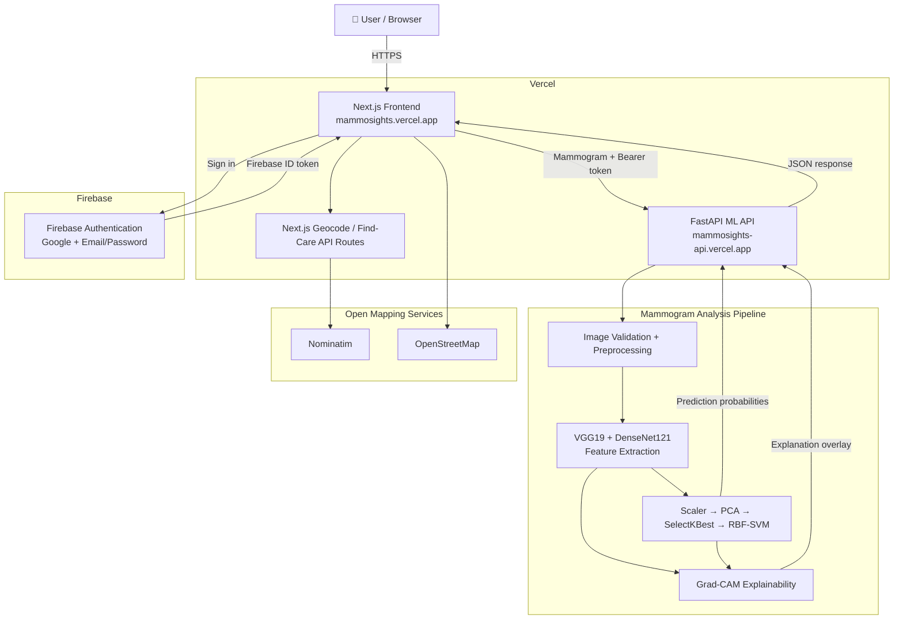
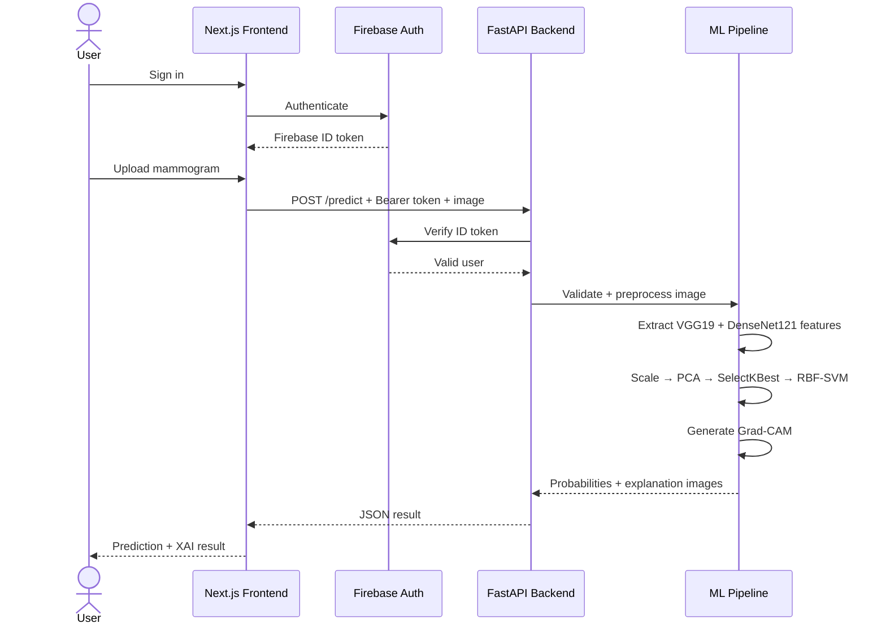
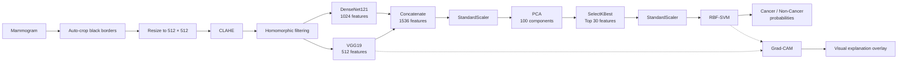
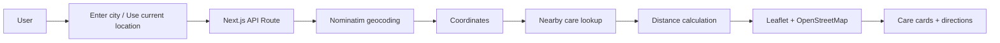

<div align="center">

# 🎀 MammoSights

### AI-assisted mammogram analysis with explainable visual insights

[](https://mammosights.vercel.app)
[](https://mammosights-api.vercel.app/health)
[](https://github.com/Payoshnee/MammoSights)

<br />


</div>

---

## 🌸 Overview

**MammoSights** is an end-to-end web application for AI-assisted mammogram analysis. It combines a full machine-learning inference pipeline with visual explainability, secure authentication, a polished user-facing interface, and nearby-care discovery.

The application accepts a mammogram image, applies the same preprocessing used by the model pipeline, extracts deep features using **VGG19** and **DenseNet121**, and produces **Cancer / Non-Cancer probability estimates** using an **RBF-SVM** classifier.

To make the output easier to inspect, MammoSights also provides:

- the original uploaded mammogram
- the preprocessed model input
- a Grad-CAM explanation overlay
- probability visualization
- uncertainty handling
- model architecture and evaluation information
- nearby cancer / oncology care discovery using OpenStreetMap data

> [!IMPORTANT]
> **MammoSights is not a medical device and is not intended for diagnosis.**
> Its output should not be used to make medical decisions. Mammogram interpretation and breast-health concerns should be discussed with a qualified healthcare professional.

---

## 🔗 Live Links

| Service | URL |
|---|---|
| 🌐 **MammoSights Web App** | https://mammosights.vercel.app |
| ⚡ **FastAPI Backend** | https://mammosights-api.vercel.app |
| ❤️ **API Health Check** | https://mammosights-api.vercel.app/health |
| 📚 **FastAPI Swagger Docs** | https://mammosights-api.vercel.app/docs |
| 💻 **GitHub Repository** | https://github.com/Payoshnee/MammoSights |

---

## ✨ Key Features

### 🎀 User experience
- Responsive interface for desktop and mobile
- Email/password authentication
- Google sign-in with Firebase Authentication
- Protected analysis routes
- Mammogram upload with validation
- Cancer and Non-Cancer probability display
- Clear uncertain-result state near the decision boundary
- Medical-use disclaimer throughout the experience

### 🧠 Explainable AI
- Displays the model's preprocessed input
- Generates a Grad-CAM overlay
- Shows which image regions had greater influence on the model's prediction
- Provides an ML-expert view of the pipeline and evaluation information

> Grad-CAM is an **explanation aid**, not a tumor or lesion-localization system.

### 🏥 Find Care
- Search by city / location
- Browser current-location support
- Interactive Leaflet map
- OpenStreetMap tiles
- Nominatim-based geocoding and nearby-care discovery
- Distance calculation
- Map focus and external directions links

OpenStreetMap/Nominatim listings may be incomplete, so provider details should always be verified independently.

### 🔐 Security & privacy
- Firebase ID-token verification on protected prediction requests
- Restricted CORS configuration
- File-size and image-format validation
- Uploaded mammograms are processed **in memory**
- The backend does not write uploaded images to disk
- Firebase service-account credentials and local environment files are excluded from Git

---

# 🏗️ System Architecture



---

# 🔄 Prediction Request Flow



---

# 🧬 Machine-Learning Pipeline



### Pipeline summary

```text
Mammogram
  ↓
Auto-crop black borders
  ↓
Resize to 512 × 512
  ↓
CLAHE
  ↓
Homomorphic filtering
  ↓
VGG19 (512) + DenseNet121 (1024)
  ↓
1536-dimensional feature vector
  ↓
StandardScaler
  ↓
PCA (100)
  ↓
SelectKBest (30)
  ↓
StandardScaler
  ↓
RBF-SVM
  ↓
Cancer / Non-Cancer probabilities
```

The positive model class is explicitly defined as:

```text
0 → Non-Cancer
1 → Cancer
```

---

# 🧩 System Design Decisions

### Separate frontend and inference deployments
MammoSights is deployed as two independent Vercel projects:

```text
Frontend
mammosights.vercel.app

        ↓ HTTPS

Backend ML API
mammosights-api.vercel.app
```

This keeps the user interface independent from the Python/TensorFlow inference runtime.

### Token-based API protection
The frontend retrieves a Firebase ID token after authentication and sends it to the backend as:

```http
Authorization: Bearer <firebase-id-token>
```

The backend verifies the token before allowing protected inference requests.

### In-memory image processing
Uploaded images are decoded, validated, transformed, analyzed, and returned without being written to backend storage.

### Serialized inference
The backend serializes inference calls because the ML module maintains shared Keras models in memory.

### Location services without Google Maps billing
Find Care uses:

```text
Leaflet
  +
OpenStreetMap
  +
Nominatim
```

so the application does not depend on Google Maps billing.

---

# 🛠️ Technology Stack

| Layer | Technology |
|---|---|
| Frontend | Next.js, React, TypeScript |
| Styling | Tailwind CSS |
| Authentication | Firebase Authentication |
| Backend | FastAPI, Python |
| Deep Learning | TensorFlow / Keras |
| CNN Backbones | VGG19, DenseNet121 |
| Classical ML | scikit-learn |
| Classifier | RBF-SVM |
| Image Processing | OpenCV, Pillow |
| Explainability | Grad-CAM |
| Map UI | Leaflet, React Leaflet |
| Geocoding / Care Search | Nominatim |
| Map Tiles | OpenStreetMap |
| Frontend Hosting | Vercel |
| Backend Hosting | Vercel Large Functions |
| Model Serialization | Joblib |

---

# 📁 Repository Structure

```text
MammoSights/
│
├── frontend/
│   ├── app/
│   │   ├── analyse/
│   │   ├── api/
│   │   │   ├── geocode/
│   │   │   └── nearby-care/
│   │   ├── dashboard/
│   │   ├── find-care/
│   │   ├── login/
│   │   ├── result/
│   │   ├── globals.css
│   │   ├── layout.tsx
│   │   └── page.tsx
│   ├── components/
│   ├── lib/
│   ├── public/
│   │   └── mammosights-hero.png
│   ├── .env.example
│   └── package.json
│
├── backend/
│   ├── model/
│   │   ├── pipeline.joblib
│   │   └── metrics.json
│   ├── main.py
│   ├── mammo_core.py
│   ├── train_export.py
│   ├── requirements.txt
│   └── .env.example
│
├── .gitignore
└── README.md
```

---

# 🖼️ Interface Preview

<div align="center">


</div>

The live application is available at **[mammosights.vercel.app](https://mammosights.vercel.app)**.

---

# ⚡ Backend API

Base URL:

```text
https://mammosights-api.vercel.app
```

| Method | Endpoint | Purpose | Authentication |
|---|---|---|---|
| `GET` | `/health` | Service/model health | No |
| `GET` | `/metrics` | Model evaluation data | No |
| `POST` | `/predict` | Mammogram prediction + XAI output | Firebase Bearer token |

### Health check

```bash
curl https://mammosights-api.vercel.app/health
```

Example:

```json
{
  "status": "ok",
  "model_loaded": true,
  "metrics_loaded": true
}
```

### Prediction request

```http
POST /predict
Authorization: Bearer <firebase-id-token>
Content-Type: multipart/form-data
```

The API accepts JPEG and PNG mammogram images and returns:

- predicted class
- cancer probability
- non-cancer probability
- uncertainty state
- warnings
- Grad-CAM overlay
- preprocessed image
- CLAHE image

---

# 🚀 Local Development

## 1. Clone the repository

```bash
git clone https://github.com/Payoshnee/MammoSights.git
cd MammoSights
```

## 2. Frontend

```bash
cd frontend
npm install
```

Create `frontend/.env.local` using `frontend/.env.example` as a guide.

```bash
npm run dev
```

Frontend:

```text
http://localhost:3000
```

## 3. Backend

```bash
cd backend
python -m venv .venv
```

Windows PowerShell:

```powershell
.\.venv\Scripts\Activate.ps1
```

macOS / Linux:

```bash
source .venv/bin/activate
```

Install dependencies:

```bash
pip install -r requirements.txt
```

Create `backend/.env` using `backend/.env.example` as a guide.

Start FastAPI:

```bash
python -m uvicorn main:app --reload
```

Backend:

```text
http://127.0.0.1:8000
```

Swagger:

```text
http://127.0.0.1:8000/docs
```

---

# 🔐 Environment Variables

## Frontend

| Variable | Purpose |
|---|---|
| `NEXT_PUBLIC_API_URL` | FastAPI backend URL |
| `NEXT_PUBLIC_FIREBASE_API_KEY` | Firebase web client key |
| `NEXT_PUBLIC_FIREBASE_AUTH_DOMAIN` | Firebase authentication domain |
| `NEXT_PUBLIC_FIREBASE_PROJECT_ID` | Firebase project ID |
| `NEXT_PUBLIC_FIREBASE_APP_ID` | Firebase web application ID |
| `NEXT_PUBLIC_DEV_SKIP_AUTH` | Development-only authentication bypass flag |

Production:

```env
NEXT_PUBLIC_API_URL=https://mammosights-api.vercel.app
NEXT_PUBLIC_DEV_SKIP_AUTH=false
```

## Backend

| Variable | Purpose |
|---|---|
| `REQUIRE_AUTH` | Require Firebase ID-token verification |
| `MODEL_DIR` | Directory containing exported model files |
| `MAX_UPLOAD_MB` | Maximum uploaded image size |
| `BACKBONE_WEIGHTS` | CNN backbone weights configuration |
| `FRONTEND_ORIGIN` | Allowed frontend origins for CORS |
| `FIREBASE_SERVICE_ACCOUNT_JSON` | Firebase Admin credential for hosted deployment |
| `GOOGLE_APPLICATION_CREDENTIALS` | Optional local Firebase credential-file path |

Example production configuration:

```env
REQUIRE_AUTH=true
MODEL_DIR=model
MAX_UPLOAD_MB=10
BACKBONE_WEIGHTS=imagenet
FRONTEND_ORIGIN=http://localhost:3000,https://mammosights.vercel.app
```

> [!CAUTION]
> Never commit `.env`, `.env.local`, or a Firebase service-account JSON file to Git.

---

# ☁️ Deployment

## Frontend — Vercel

```text
Repository: Payoshnee/MammoSights
Root Directory: frontend
Framework: Next.js
Production URL: https://mammosights.vercel.app
```

## Backend — Vercel

```text
Repository: Payoshnee/MammoSights
Root Directory: backend
Framework: FastAPI
Production URL: https://mammosights-api.vercel.app
```

The ML backend uses Vercel's large-function support because TensorFlow and the CNN dependencies produce a large Python deployment bundle.

Firebase Authentication must authorize:

```text
mammosights.vercel.app
```

and the backend CORS configuration must allow the deployed frontend origin.

---

# 📊 Model Evaluation

The backend exposes the exported evaluation artifact through:

```text
GET /metrics
```

The training/export pipeline performs the train/test split before fitting the scaler, PCA, feature selection, and classifier for evaluation.

Model metrics should be interpreted as **dataset-specific experimental performance**, not clinical performance.

If multiple images originate from the same patient, evaluation should use a patient-level split to avoid overly optimistic estimates.

---

# 🛡️ Validation & Safety Controls

The backend includes several defensive checks:

- only JPEG and PNG uploads are accepted
- upload-size limits
- minimum image dimensions
- warning when an image appears to be a colour photograph rather than a greyscale mammogram
- uncertainty state around near-boundary probabilities
- Firebase token verification for protected predictions
- no permanent backend image storage
- CORS restrictions
- graceful errors when model artifacts are unavailable

---

# ⚠️ Limitations

1. MammoSights is **not clinically validated** and must not be treated as a diagnostic system.
2. Prediction quality depends on how closely an input resembles the data used to develop the model.
3. Grad-CAM indicates influential image regions; it does **not** prove the presence or location of a lesion.
4. Nearby-care results depend on OpenStreetMap/Nominatim data and may be incomplete or outdated.
5. Serverless deployment can introduce cold-start latency.
6. Evaluation on related images from the same patient can overestimate model performance unless patient-level splitting is used.

---

# 🗺️ Find Care Data Flow



MammoSights presents these as **nearby care options**, not endorsements or rankings.

---

# 🔮 Possible Future Enhancements

- patient-level validation when patient identifiers are available
- broader independent external validation
- DICOM support
- additional explainability methods
- improved care-provider verification
- accessibility audits
- automated backend health monitoring
- custom domain
- CI/CD checks for frontend and backend
- model-card documentation

---

# 🤝 Contributing

Suggestions and improvements are welcome.

1. Fork the repository
2. Create a feature branch
3. Make your changes
4. Test both frontend and backend
5. Open a pull request

For bugs or feature requests, use the repository's **Issues** section.

---

# 🩺 Medical Disclaimer

**MammoSights is not a medical device and is not intended to diagnose, rule out, or treat breast cancer or any other condition.**

The model output, probability values, preprocessing views, and Grad-CAM visualizations are informational demonstrations of an AI pipeline. They are not substitutes for mammography interpretation by qualified clinicians, radiologists, pathology, or appropriate medical evaluation.

If you have a breast-health concern, seek advice from an appropriately qualified healthcare professional.

---

<div align="center">

### 🎀 MammoSights

**Clarity when you need it most.**

[Live App](https://mammosights.vercel.app) ·
[API](https://mammosights-api.vercel.app/health) ·
[Repository](https://github.com/Payoshnee/MammoSights)

</div>
